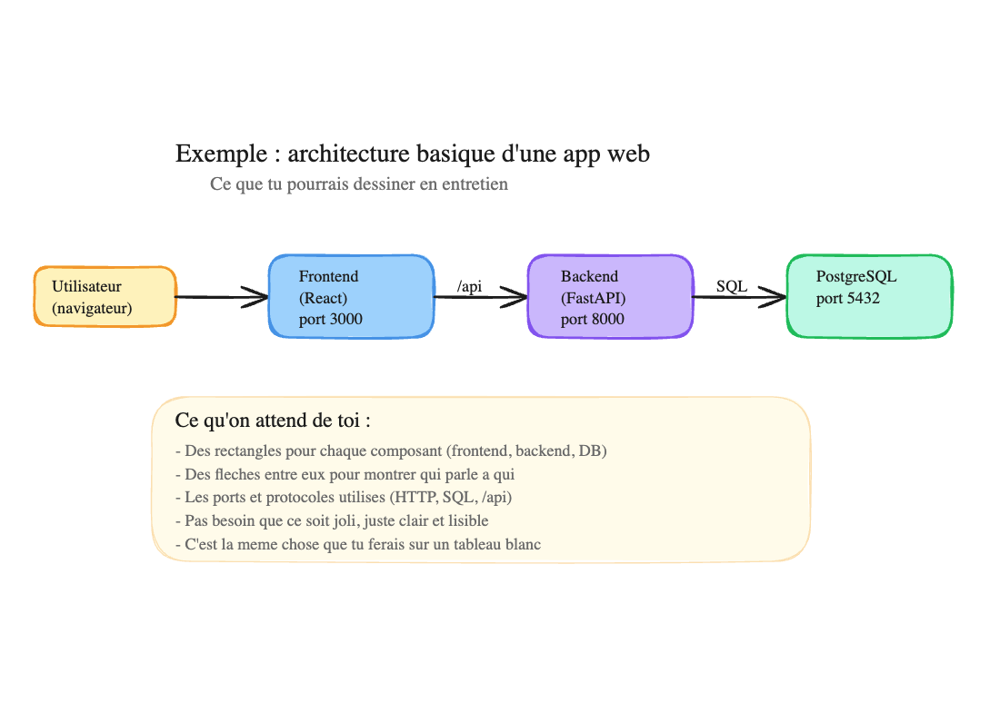
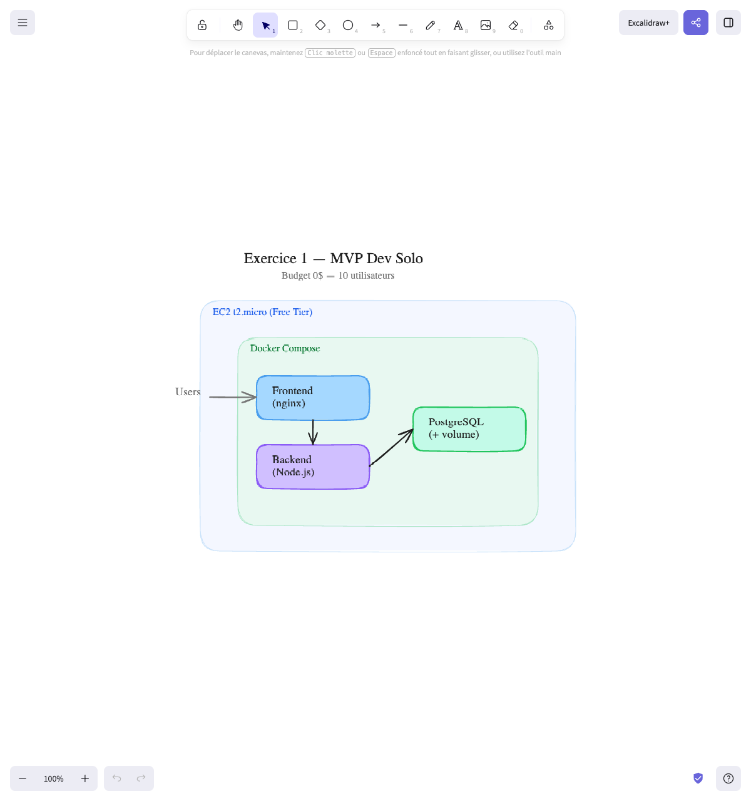
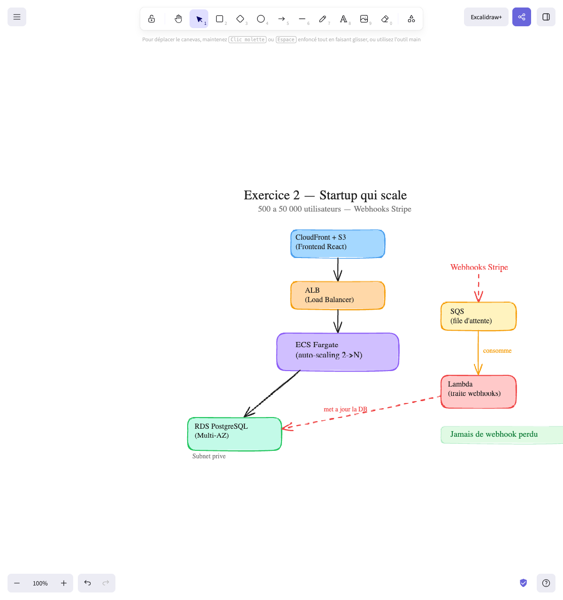
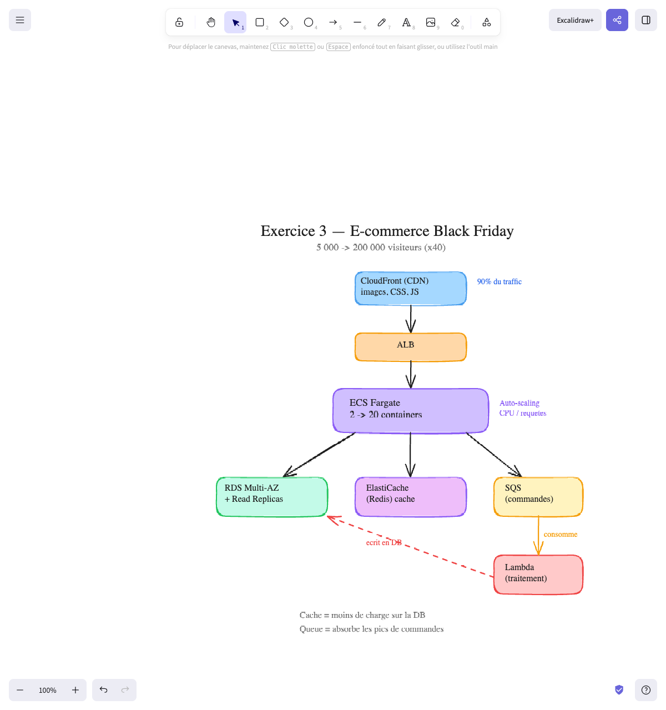
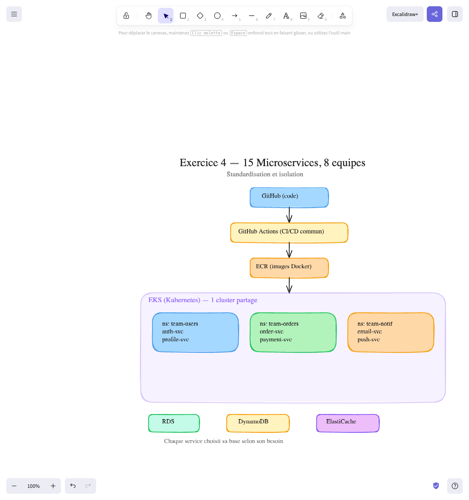
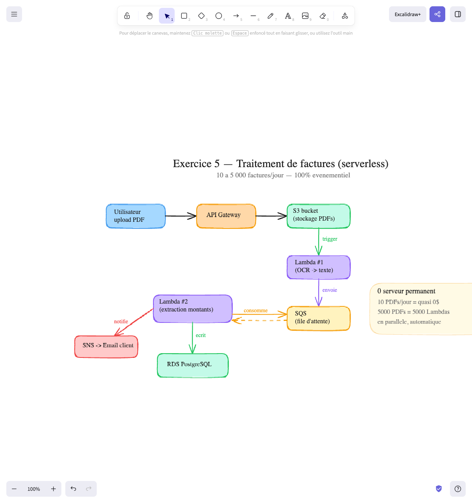

# Exercices System Design — Entretien DevOps

> Ce type de question est **très courant en entretien DevOps**. On te donne un projet et on te demande comment tu le déploierais. Il n'y a pas de réponse parfaite — ce qui compte c'est ta façon de raisonner.
>
> **Ces exercices utilisent des services que tu n'as pas forcément déployé dans ce cursus** (ECS, SQS, Lambda, CloudFront...). C'est normal — ce sont des exercices de réflexion, pas de pratique. Le but est de t'entraîner à penser architecture.

## La méthode — Comment aborder TOUTE question de system design

Avant de regarder les exercices, retiens cette méthode. Elle marche pour n'importe quel énoncé :

1. **Pose des questions avant de répondre** — Quel budget ? Combien d'utilisateurs ? Quelle taille d'équipe ? Y a-t-il de l'infra existante ?
2. **Identifie les composants** — Frontend, backend, base de données, services externes, jobs en arrière-plan...
3. **Identifie les points critiques** — Qu'est-ce qui ne doit surtout pas casser ? Qu'est-ce qui doit scaler ?
4. **Propose une solution simple d'abord**, puis fais évoluer si le besoin le demande
5. **Justifie chaque choix** et mentionne les alternatives que tu n'as pas choisies

> **Le piège à éviter :** ne pas sur-engineer. La bonne réponse est celle qui **colle au besoin**, pas celle qui utilise le plus de services. Un EC2 avec Docker Compose est une réponse parfaitement valable si le contexte s'y prête.

## Comment utiliser ces exercices

Ne saute pas directement à la solution. L'intérêt c'est de **réfléchir par toi-même** avant de regarder la réponse. Voici l'ordre à suivre :

1. **Lis l'énoncé** et **note tes propres questions** — quelles infos te manquent pour proposer une solution ? Budget ? Nombre d'utilisateurs ? Taille de l'équipe ? Note-les sur papier ou dans ta tête avant de continuer
2. **Ouvre "Questions à poser"** — compare avec les tiennes. Tu en avais trouvé d'autres ? C'est bien, ça montre que tu réfléchis. Tu en avais oublié ? C'est normal, ça viendra avec la pratique
3. **Ouvre "Réponses de l'interviewer"** — lis les réponses et réfléchis à comment ça oriente ton architecture
4. **Dessine ton architecture** sur papier ou sur [excalidraw.com](https://excalidraw.com) (un tableau blanc en ligne, gratuit). C'est exactement ce que tu ferais en entretien sur un tableau blanc. Si tu ne sais pas quoi dessiner, voici un exemple simple :



   C'est tout ce qu'on attend : des rectangles pour chaque composant, des flèches pour montrer qui parle à qui, et les ports/protocoles utilisés. Pas besoin que ce soit joli — juste clair et lisible. Les couleurs sur l'image c'est juste pour la lisibilité ici — en entretien ou pour cet exercice, des carrés en noir et blanc avec du texte dedans c'est déjà parfait.

5. **Ouvre "Solution"** — compare avec ton schéma. Tu n'as pas la même réponse ? C'est pas grave — ce qui compte c'est que tu saches **justifier** tes choix

---

## Exercice 1 — Le MVP d'un dev solo

> « Un ami développeur lance un side project : une app de prise de notes (frontend React + API Node.js + base PostgreSQL). Il est seul, il a 0€ de budget, et il espère avoir une dizaine d'utilisateurs au début. Il te demande : comment je mets ça en ligne ? »

<details>
<summary>💡 Questions à poser</summary>

- C'est un side project ou il veut en faire un business ?
- Il a un nom de domaine ?
- Il a déjà un compte AWS ou il préfère quelque chose de plus simple ?
- C'est juste pour montrer le projet (portfolio) ou il y aura de vrais utilisateurs ?

</details>

<details>
<summary>🎙️ Réponses de l'interviewer</summary>

> « C'est un side project pour l'instant, mais s'il a du succès il veut en faire un vrai produit. Pas de nom de domaine pour l'instant. Il n'a pas de compte AWS mais il est prêt à en créer un. L'objectif c'est d'avoir quelque chose en ligne pour le montrer à des amis et potentiellement des premiers utilisateurs. Budget : 0€. »

**Ce que ça t'apprend :**
- Budget 0€ → Free Tier AWS, pas de services payants
- Side project qui pourrait évoluer → la solution doit être simple mais pas jetable
- Pas de nom de domaine → on ne s'embête pas avec Route 53 pour l'instant, une IP publique suffit

</details>

<details>
<summary>✅ Solution</summary>

**L'architecture :**

```
1 EC2 t3.micro (Free Tier)
├── Docker Compose
│   ├── Frontend (nginx)
│   ├── Backend (Node.js)
│   └── PostgreSQL (avec volume)
```

**Pourquoi :**
- **1 seul EC2 avec Docker Compose** — 10 utilisateurs, un seul dev, 0 budget. Pas besoin de plus. Le Free Tier AWS offre 750h/mois de t3.micro, soit 1 instance 24/7 gratuitement pendant 12 mois
- **PostgreSQL en container avec volume** — pas de RDS (coûte de l'argent au-delà du Free Tier). Pour 10 utilisateurs, PostgreSQL en Docker suffit largement. Le volume persiste les données
- **Tout dans un docker-compose.yml** — un seul fichier, un seul `docker compose up`, c'est déployé
- **CI/CD basique** — un GitHub Actions qui build et teste, le déploiement peut être un simple `ssh + git pull + docker compose up` pour l'instant

**Alternatives non choisies :**

| Alternative | Pourquoi non |
|-------------|-------------|
| **ECS Fargate** | Over-kill pour 10 users. Plus complexe à configurer. Coûte plus cher qu'un EC2 Free Tier |
| **Vercel/Netlify + Railway** | Bonne alternative ! Plus simple qu'AWS. Mais l'ami veut probablement apprendre AWS (c'est plus vendeur sur un CV) |
| **RDS** | Le surcoût ne se justifie pas pour un side project. Si la base crash, on restaure depuis un backup Git/local |
| **Lambda** | L'API tourne en continu pour servir les utilisateurs. Lambda ajouterait des cold starts inutiles |

**Ce que le recruteur attend :**
- Que tu ne proposes PAS Kubernetes pour un side project
- Que tu connaisses le Free Tier et que tu optimises le coût
- Que tu saches qu'un seul EC2 avec Docker Compose est une réponse valable

**Schéma final :**



</details>

---

## Exercice 2 — La startup qui scale

> « Une startup lance une app de livraison de repas. Ils ont un frontend React, une API backend en Python, et une base PostgreSQL. Aujourd'hui ils ont 500 utilisateurs, mais ils espèrent passer à 50 000 dans 6 mois. L'API reçoit aussi des webhooks de paiement Stripe qui ne doivent jamais être perdus. Comment tu déploierais ça sur AWS ? »

<details>
<summary>💡 Questions à poser</summary>

- Quel budget mensuel ? (une startup early-stage vs une startup avec levée de fonds, c'est pas le même budget)
- Quelle taille d'équipe DevOps ? (1 DevOps vs une équipe de 5)
- Y a-t-il de l'infra existante ou on part de zéro ?
- Le traffic est constant ou avec des pics (midi, soir) ?

</details>

<details>
<summary>🎙️ Réponses de l'interviewer</summary>

> « La startup a levé 2M€ il y a 3 mois. Budget infra : autour de 500€/mois, on peut aller plus haut si c'est justifié. On a un DevOps (toi) et 5 développeurs. Pas d'infra existante, on part de zéro. Le traffic a des pics à midi et le soir (heures de repas), c'est assez logique. Le point critique c'est vraiment les webhooks Stripe — on a déjà perdu des confirmations de paiement et des clients se sont plaints. »

**Ce que ça t'apprend :**
- Budget correct (500€/mois) → on peut se permettre ECS Fargate + RDS, pas besoin de rester sur un seul EC2
- 1 DevOps seul → la solution doit être maintenable par une personne (pas de Kubernetes)
- Pics midi/soir → besoin d'auto-scaling
- Webhooks perdus = problème critique → il faut absolument découpler avec une file d'attente

</details>

<details>
<summary>✅ Solution</summary>

**L'architecture :**

Le flow principal (à gauche) et le flow webhooks (à droite) sont **séparés** :

```
Flow principal :                          Flow webhooks :

CloudFront + S3 (frontend)                Webhooks Stripe
        │                                       │ (arrivent)
        ▼                                       ▼
    ALB (Load Balancer)                    SQS (file d'attente)
        │                                       │
        ▼                                       │ consomme
  ECS Fargate (2→N)                              ▼
        │                                  Lambda (traite)
        ▼                                       │
  RDS PostgreSQL  ◄─── ─── ─── ─── ─── ─── ────┘
  (Multi-AZ)              met à jour la DB
```

**Pourquoi ces choix :**

| Composant | Choix | Pourquoi |
|-----------|-------|----------|
| Frontend | **S3 + CloudFront** | Le frontend React = des fichiers statiques. Pas besoin d'un serveur. S3 héberge, CloudFront distribue partout dans le monde (CDN) |
| Backend API | **ECS Fargate** | L'API doit scaler de 500 à 50 000 users. Fargate scale automatiquement les containers sans gérer de serveurs |
| Base de données | **RDS Multi-AZ** | Les données (users, commandes, restaurants) sont relationnelles → PostgreSQL. Multi-AZ pour la haute disponibilité |
| Webhooks Stripe | **SQS + Lambda** | Les webhooks arrivent dans SQS (file d'attente). Lambda consomme la queue et traite les messages. Si Lambda échoue, le message reste dans SQS et sera re-traité. Rien n'est perdu |
| Load Balancer | **ALB** | Répartit le traffic entre les containers ECS + health check automatique |

**Alternatives non choisies :**

| Alternative | Pourquoi non |
|-------------|-------------|
| **Docker sur un EC2** | Marche pour 500 users mais ne scale pas. À 50 000, il faudrait tout refaire |
| **EKS** | Plus flexible mais plus complexe et plus cher. Pas besoin de portabilité multi-cloud pour l'instant |
| **Lambda pour l'API** | Cold starts + traffic continu = pas idéal. ECS est plus prévisible |
| **DynamoDB au lieu de RDS** | Données très relationnelles (users → commandes → restaurants). SQL est plus adapté ici |

**Comment le présenter en entretien :**
1. "Pour 500 users, un EC2 avec Docker Compose suffirait"
2. "Mais comme ils visent 50 000, je partirais directement sur ECS Fargate"
3. "Le point critique c'est les webhooks Stripe — je mettrais une SQS devant pour ne jamais en perdre"

**Schéma final :**



</details>

---

## Exercice 3 — Le site e-commerce et le Black Friday

> « Tu travailles pour un e-commerce de mode. Le site a normalement 5 000 visiteurs par jour. Mais pendant le Black Friday (3 jours par an), le traffic monte à 200 000 visiteurs par jour, soit 40 fois plus. L'année dernière, le site est tombé pendant le pic. Le CTO te demande de résoudre ça pour cette année. »

<details>
<summary>💡 Questions à poser</summary>

- L'architecture actuelle c'est quoi exactement ? (combien de serveurs, où est la base, comment c'est déployé)
- Quel est le budget pour cette migration ?
- Est-ce qu'on peut avoir un temps de maintenance pour migrer ?
- Les pics sont uniquement le Black Friday ou il y en a d'autres (soldes, Noël) ?
- Qu'est-ce qui a cassé l'année dernière exactement ? (le serveur, la base, le réseau ?)

</details>

<details>
<summary>🎙️ Réponses de l'interviewer</summary>

> « Aujourd'hui on a 2 EC2 derrière un load balancer, avec PostgreSQL sur un 3ème EC2 (pas de RDS). Le déploiement c'est du SSH + git pull. Budget : pas de limite raisonnable, le Black Friday de l'année dernière nous a coûté 200k€ de ventes perdues, donc tout investissement est rentable. On peut avoir une fenêtre de maintenance la nuit. Les pics c'est Black Friday, soldes d'été et de Noël — donc environ 4 à 5 fois par an. L'année dernière, c'est la base de données qui a lâché en premier (trop de requêtes), puis les 2 EC2 ont saturé en CPU. »

**Ce que ça t'apprend :**
- L'infra actuelle est fragile : pas de scaling auto, base non managée, déploiement manuel
- Budget illimité (raisonnable) → on peut investir dans une vraie infra
- La base a lâché en premier → il faut un cache devant et des Read Replicas
- Les EC2 ont saturé → il faut de l'auto-scaling
- 4-5 pics par an → l'auto-scaling doit être automatique, pas une action manuelle à chaque pic

</details>

<details>
<summary>✅ Solution</summary>

**Le problème principal :** le site doit encaisser 40x son traffic normal pendant quelques jours, puis revenir à la normale. Payer une infra massive 365 jours pour 3 jours de pic, c'est du gaspillage. Il faut de l'**auto-scaling**.

**L'architecture :**

```
  CloudFront (CDN) ← 90% du traffic (images, CSS, JS)
        │
        ▼
      ALB
        │
        ▼
  ECS Fargate (2→20 containers, auto-scaling)
        │
        ├──────────────────┬──────────────────┐
        ▼                  ▼                  ▼
  RDS Multi-AZ      ElastiCache         SQS (commandes)
  + Read Replicas   (Redis) cache             │
        ▲                                     │ consomme
        │                                     ▼
        └──── ─── ─── ─── ─── ──── Lambda (traitement)
                   écrit en DB
```

**Pourquoi ces choix :**

| Composant | Choix | Pourquoi |
|-----------|-------|----------|
| CDN | **CloudFront** | Les images de produits, CSS, JS représentent 90% des requêtes. CloudFront les cache au plus proche des utilisateurs. Le serveur ne voit que les requêtes dynamiques (ajout panier, paiement) |
| Backend | **ECS Fargate auto-scaling** | 2 containers en temps normal, monte à 20 pendant le Black Friday automatiquement (basé sur le CPU ou le nombre de requêtes). Après le pic, ça redescend |
| Cache | **ElastiCache (Redis)** | Les fiches produits ne changent pas toutes les secondes. On les met en cache. Au lieu de demander à la base 200 000 fois "donne-moi le produit X", la base répond 1 fois, Redis garde la réponse en cache |
| Commandes | **SQS → Lambda** | Pendant le pic, 1 000 personnes commandent en même temps. ECS met les commandes dans SQS (file d'attente). Lambda consomme la queue et traite les commandes une par une, à son rythme, puis écrit en base. L'utilisateur voit "Commande en cours de traitement" et reçoit un email de confirmation |
| Base | **RDS Multi-AZ + Read Replicas** | La base principale gère les écritures (commandes via Lambda). Les Read Replicas gèrent les lectures (catalogue produits). Ça divise la charge |

**Alternatives non choisies :**

| Alternative | Pourquoi non |
|-------------|-------------|
| **Passer à un EC2 plus gros pendant le Black Friday** | Scaling vertical = downtime pour redimensionner. Et un seul gros serveur qui crash = tout tombe |
| **DynamoDB au lieu de RDS** | Le catalogue produits a beaucoup de relations (catégories, tailles, couleurs, stocks par entrepôt). SQL est plus adapté |
| **Tout en Lambda** | Possible mais les connexions DB depuis Lambda sont compliquées (besoin de RDS Proxy). ECS est plus adapté pour un site web classique |

**Ce que le recruteur attend :**
- Tu identifies que le vrai problème c'est les pics (pas le traffic normal)
- Tu proposes de l'auto-scaling, pas juste "un plus gros serveur"
- Tu penses au cache (CDN + Redis) pour réduire la charge
- Tu penses aux files d'attente pour absorber les pics de commandes

**Schéma final :**



</details>

---

## Exercice 4 — L'entreprise aux 15 microservices

> « Tu rejoins une entreprise de 200 personnes avec 8 équipes de développement. Chaque équipe maintient 1 à 3 microservices (15 au total). Aujourd'hui chaque équipe déploie ses services à sa façon : certains utilisent EC2, d'autres ECS, un gars a même déployé directement sur sa machine. C'est le chaos. Le CTO te demande d'unifier le déploiement. »

<details>
<summary>💡 Questions à poser</summary>

- Toutes les équipes utilisent Docker ?
- Il y a un CI/CD commun ou chaque équipe a le sien ?
- Quel cloud ? Tout sur AWS ou multi-cloud ?
- Quel budget pour la migration ?
- Combien de temps on a pour migrer ?
- Est-ce que certains services communiquent entre eux ?

</details>

<details>
<summary>🎙️ Réponses de l'interviewer</summary>

> « Presque toutes les équipes utilisent Docker, sauf une qui tourne encore directement sur un EC2 avec un venv Python. Il n'y a pas de CI/CD commun — 3 équipes utilisent GitHub Actions, 2 utilisent GitLab CI, et les autres déploient manuellement. Tout est sur AWS. Le budget est confortable, c'est une entreprise établie. On veut migrer progressivement — pas de big bang, équipe par équipe, sur 6 mois. Oui, les services communiquent beaucoup entre eux : l'order-service appelle le payment-service, le notification-service écoute les événements de plusieurs autres services. »

**Ce que ça t'apprend :**
- Presque tout en Docker → Kubernetes est une option réaliste (pas besoin de tout recontaineriser)
- Pas de CI/CD commun → première étape : standardiser le pipeline
- Tout sur AWS → pas besoin de portabilité multi-cloud, mais K8s reste un bon choix pour la standardisation
- Migration progressive → architecture qui permet de migrer service par service
- Services qui communiquent → besoin d'un service mesh ou d'un DNS interne (K8s gère ça nativement)

</details>

<details>
<summary>✅ Solution</summary>

**Le problème principal :** 15 services, 8 équipes, zéro standardisation. Le but n'est pas d'avoir l'architecture parfaite, mais une plateforme commune que tout le monde utilise.

**L'architecture :**

```
                    GitHub (code de chaque service)
                               │
                    ┌──────────┴──────────┐
                    │   GitHub Actions     │  ← Pipeline CI/CD commun
                    │   (par service)      │     (lint → test → build → push image)
                    └──────────┬──────────┘
                               │
                    ┌──────────┴──────────┐
                    │   ECR               │  ← Registry d'images Docker (1 repo par service)
                    └──────────┬──────────┘
                               │
                    ┌──────────┴──────────┐
                    │   EKS (Kubernetes)   │  ← Un cluster partagé, un namespace par équipe
                    │                      │
                    │  ┌────────────────┐  │
                    │  │ ns: team-users │  │  ← Équipe Users : auth-service, profile-service
                    │  │ ns: team-orders│  │  ← Équipe Orders : order-service, payment-service
                    │  │ ns: team-notif │  │  ← Équipe Notif : email-service, push-service
                    │  │ ...            │  │
                    │  └────────────────┘  │
                    └──────────┬──────────┘
                               │
              ┌────────────────┼────────────────┐
              │                │                 │
    ┌─────────┴──┐    ┌───────┴──────┐   ┌─────┴──────┐
    │  RDS       │    │  DynamoDB    │   │  ElastiCache│
    │  (certains)│    │  (certains)  │   │  (Redis)    │
    └────────────┘    └──────────────┘   └────────────┘
```

**Pourquoi ces choix :**

| Composant | Choix | Pourquoi |
|-----------|-------|----------|
| Orchestration | **EKS (Kubernetes)** | 15 microservices = besoin d'orchestration. K8s est le standard pour ça. Chaque équipe a son **namespace** (son espace isolé dans le cluster) avec ses propres services, quotas de ressources, et permissions |
| CI/CD | **GitHub Actions + template commun** | Un pipeline standard que chaque équipe adapte minimalement. Même processus : lint → test → build image → push vers ECR → deploy sur K8s |
| Registry | **ECR** | Un repo d'images Docker par service. Intégré à AWS, pas besoin de gérer Docker Hub |
| Base de données | **Mix RDS + DynamoDB** | Chaque service choisit ce qui lui convient. Le service de commandes a besoin de SQL → RDS. Le service de sessions a besoin de rapidité → DynamoDB |

**Pourquoi Kubernetes et pas ECS ici :**
- 15 services, 8 équipes → il faut une isolation forte (namespaces, quotas, RBAC)
- Les équipes doivent pouvoir déployer indépendamment sans casser les autres
- K8s est un standard que les développeurs connaissent (ou peuvent apprendre une fois)
- La portabilité est un bonus si l'entreprise veut changer de cloud un jour

**Alternatives non choisies :**

| Alternative | Pourquoi non |
|-------------|-------------|
| **ECS** | Fonctionne mais moins d'isolation entre équipes. Pas de concept de namespace natif. Plus difficile de donner à chaque équipe son espace |
| **Un EC2 par service** | 15 EC2 à maintenir = cauchemar opérationnel. Pas de standardisation |
| **Lambda pour tout** | Certains services tournent en continu (API), d'autres sont événementiels. Lambda ne convient pas à tous |
| **Un cluster K8s par équipe** | 8 clusters = trop cher et trop complexe. Un seul cluster avec des namespaces suffit |

**Ce que le recruteur attend :**
- Tu penses à la standardisation (un pipeline commun, une plateforme commune)
- Tu ne proposes pas de tout réécrire — tu donnes un cadre dans lequel les équipes migrent progressivement
- Tu sais que Kubernetes fait sens ici (beaucoup de services, besoin d'isolation)
- Tu mentionnes les namespaces pour isoler les équipes

**Schéma final :**



</details>

---

## Exercice 5 — Le traitement de fichiers uploadés

> « Une entreprise de comptabilité permet à ses clients d'uploader des factures en PDF. Chaque facture doit être : 1) stockée, 2) convertie en texte (OCR), 3) les montants doivent être extraits et enregistrés en base. Le volume est très variable : parfois 10 factures par jour, parfois 5 000 (fin de mois). Comment tu architectures ça ? »

<details>
<summary>💡 Questions à poser</summary>

- Quelle taille font les PDFs en moyenne ?
- Combien de temps l'OCR prend par facture ?
- L'utilisateur a besoin du résultat immédiatement ou il peut attendre quelques minutes ?
- Les données extraites sont sensibles ? (factures = données financières)

</details>

<details>
<summary>🎙️ Réponses de l'interviewer</summary>

> « Les PDFs font entre 100 Ko et 5 Mo. L'OCR prend environ 10-30 secondes par facture. Non, l'utilisateur n'a pas besoin du résultat en temps réel — il upload ses factures, il revient plus tard ou il reçoit un email quand c'est prêt. Oui, les données sont sensibles, ce sont des factures avec des noms de clients, des montants, des numéros SIRET. On doit être conforme RGPD. »

**Ce que ça t'apprend :**
- Fichiers < 5 Mo → largement dans les limites de Lambda (max 10 Go de mémoire)
- OCR en 10-30 secondes → bien en dessous de la limite Lambda (15 min). Parfait pour du serverless
- Pas besoin de temps réel → on peut traiter de manière asynchrone (file d'attente)
- Données sensibles → chiffrement S3, VPC privé pour la base, IAM strict, logs d'audit

</details>

<details>
<summary>✅ Solution</summary>

**Le problème principal :** le volume est très variable (10 à 5 000 par jour). Payer un serveur 24/7 pour traiter 10 factures c'est du gaspillage. Mais il faut pouvoir encaisser 5 000 factures en fin de mois. C'est le cas d'usage parfait pour du **serverless événementiel**.

**L'architecture :**

```
Utilisateur → API Gateway → S3 bucket (stockage PDFs)
                                    │
                                    │ trigger auto
                                    ▼
                              Lambda #1 (OCR → texte)
                                    │
                                    │ envoie
                                    ▼
                              SQS (file d'attente)
                                    │
                    ┌───────────────┘
                    │ consomme
                    ▼
              Lambda #2 (extraction montants)
                 │              │
                 │ écrit        │ notifie
                 ▼              ▼
           RDS PostgreSQL    SNS → Email client
```

Lambda #2 consomme les messages de SQS, extrait les montants, écrit en base, **et** notifie le client via SNS. C'est Lambda #2 qui fait ces deux actions — pas RDS.

**Pourquoi ces choix :**

| Composant | Choix | Pourquoi |
|-----------|-------|----------|
| Upload | **API Gateway + S3** | L'utilisateur upload directement vers S3 (pas besoin de passer par un serveur). S3 peut recevoir des milliers de fichiers en parallèle |
| Stockage | **S3** | Stockage illimité, pas cher, haute durabilité. Les PDFs originaux sont conservés |
| OCR | **Lambda #1** | Déclenché automatiquement quand un fichier arrive dans S3. Si 5 000 fichiers arrivent en même temps, AWS lance 5 000 Lambdas en parallèle |
| File d'attente | **SQS** | Découple l'OCR de l'extraction. Si Lambda #2 échoue, le message reste dans la file et sera re-traité. Rien n'est perdu |
| Extraction | **Lambda #2** | Consomme SQS, extrait les montants, écrit en base, et notifie le client via SNS |
| Base | **RDS** | Les données financières sont relationnelles (client → factures → lignes → montants). SQL est adapté |
| Notification | **SNS** | Appelé par Lambda #2 après traitement — envoie un email au client |

**Le point clé : architecture événementielle**

Aucun serveur ne tourne en permanence. Tout est déclenché par des événements :
- Un fichier arrive dans S3 → déclenche Lambda #1
- Lambda #1 envoie le résultat dans SQS
- Lambda #2 consomme SQS, écrit en base, et notifie via SNS

10 factures/jour = tu paies quasi rien. 5 000 factures/jour = AWS lance 5 000 Lambdas, traite tout, et s'arrête. Tu paies uniquement ce qui est utilisé.

**Alternatives non choisies :**

| Alternative | Pourquoi non |
|-------------|-------------|
| **EC2 avec un worker qui poll S3** | Un serveur 24/7 pour 10 factures/jour c'est du gaspillage. Et il faudrait gérer le scaling manuellement pour les pics |
| **ECS avec une queue** | Plus de contrôle mais plus de complexité et de coût. Lambda est parfait ici car chaque tâche est courte (<5 min) et indépendante |
| **Tout dans une seule Lambda** | Si l'OCR échoue, on perd tout le travail. En séparant OCR et extraction avec SQS entre les deux, chaque étape peut échouer et être re-tentée indépendamment |
| **DynamoDB au lieu de RDS** | Les données financières ont des relations (client → factures → lignes). SQL avec des JOINs est plus adapté pour générer des rapports |

**Ce que le recruteur attend :**
- Tu reconnais que c'est un cas d'usage événementiel (pas une API classique)
- Tu proposes du serverless (Lambda) car le volume est variable
- Tu utilises SQS pour ne jamais perdre de données
- Tu sépares les étapes pour que chaque partie puisse échouer et être re-tentée indépendamment

**Schéma final :**



</details>

---

## Récap — Quel exercice montre quoi

| Exercice | Taille | Architecture | Ce que ça montre |
|----------|--------|-------------|------------------|
| 1. Dev solo | 1 dev, 0€ | EC2 + Docker Compose | Parfois la solution simple est la meilleure |
| 2. Startup qui scale | Startup, 500→50k users | ECS Fargate + RDS + SQS | Scaling progressif, découplage webhooks |
| 3. E-commerce Black Friday | Moyenne entreprise, pics 40x | ECS auto-scaling + CDN + cache + queue | Gérer les pics, cache, file d'attente |
| 4. 15 microservices | Grande entreprise, 8 équipes | EKS Kubernetes | Standardisation, isolation par namespace |
| 5. Traitement de fichiers | Variable | Lambda + S3 + SQS (100% serverless) | Architecture événementielle, pay-per-use |
